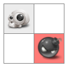
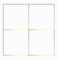
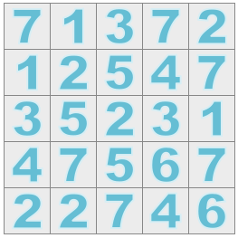
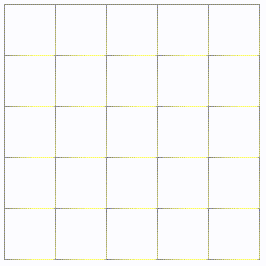

# Canvas Grid System

- [Canvas Grid System](#canvas-grid-system)
- [API](#api)
    - [constructor](#constructor)
    - [get](#get)
    - [set](#set)
    - [count](#count)
    - [find](#find)
    - [apply](#apply)
    - [position](#position)
    - [cursor](#cursor)
    - [show](#show)
    - [hide](#hide)
    - [draw](#draw)
    - [erase](#erase)
    - [mouseHandler](#mousehandler)
- [Tips & Tricks](#tips--tricks)
    - [No selecting](#no-selecting)
- [Examples](#examples)
    - [Basic](#basic)
        - [Example 1](#example-1)
        - [Example 2](#example-2)
        - [Example 3](#example-3)
        - [Example 4](#example-4)
        - [Example 5](#example-5)
    - [Advanced](#advanced)
        - [Example 6](#example-6)
        - [Example 7](#example-7)
        - [More Examples](#more-examples)

# API

## constructor

`constructor(id, options)`<br>
`new Grid('grid', {rows:5, cols:5});`<br>
```
new Grid('grid', {
    rows: 8,
    cols: 8,
    cellWidth: 50,
    cellHeight: 50,
    extraCellData: {locked:false},
    background: '#fff',
    images: {
        skull: 'gfx/skull.png',
        bomb: 'gfx/bomb.png'
    },
    mouseEvent: function(cell) {
        if (cell.action == 'click') 
            console.log(cell);
    }
})
```

| Data  | Type   | Description                        |
| ----- | ------ | ---------------------------------- |
| param | string | the HTML `ID` of the canvas object |
| param | object | {rows:5, cols:5}                   |

| All Options                 | Default | Description                         |
| --------------------------- | ------- | ----------------------------------- |
| rows                        | 10      | Number of rows                      |
| cols                        | 10      | Number of columns                   |
| cellWidth                   | 50      | Cell Width                          |
| cellHeight                  | 50      | Cell Height                         |
| background                  | #FFF    | Background Color                    |
| images                      | {}      | Pre-loaded images                   |
| extraCellData               | {}      | Extra data to store in each cell    |
| [mouseEvent](#mousehandler) | fn()    | Event Handler for the Mouse / Touch |

[Back to top](#canvas-grid-system)

## get

**Get the data for a cell**<br>
`get(row, col)`

| Data   | Type   | Description |
| ------ | ------ | ----------- |
| param  | num    | Zero Based  |
| param  | num    | Zero Based  |
| return | object | cell        |
  
[Back to top](#canvas-grid-system)

## set

**Modify/Add new data to this cell**<br>
`set(5, 5, {icon: changeThis})`

| Data   | Type | Description |
| ------ | ---- | ----------- |
| param  | num  | Zero Based  |
| param  | num  | Zero Based  |
| param  | obj  | {icon:""}   |
| return | obj  | chainable   |

[Back to top](#canvas-grid-system)

## count

**Return the number of cells that have this attribute (you can use an array for multiple values)**<br>
`count('lookingFor', findMe);`<br>
`count('lookingFor', [findMe, findMe1, findMe2]);`

| Data   | Type         | Description |
| ------ | ------------ | ----------- |
| param  | string       | data        |
| param  | string/array | key         |
| return | num          | The count   |

[Back to top](#canvas-grid-system)

## find

**Return the cells that have this attribute (you can use an array for multiple values)**<br>
`find('lookingFor', findMe);`<br>
`find('lookingFor', [findMe, findMe1, findMe2]);`

| Data   | Type         | Description |
| ------ | ------------ | ----------- |
| param  | string       | data        |
| param  | string/array | key         |
| return | array        | Found Cells |

[Back to top](#canvas-grid-system)

## apply

**Apply this attribute to every cell or to a filtered dataset**<br>
`apply('icon', 'empty');`<br>
`apply('icon', 'empty', 'visible', true);`

| Data   | Type   | Description |
| ------ | ------ | ----------- |
| param  | string | data        |
| param  | string | value       |
| param  | string | filterKey   |
| param  | string | filterValue |
| return | object | chainable   |
        
[Back to top](#canvas-grid-system)

## position

**Returns the (x, y) coordinates of a cell**<br>
`position(5, 5);`

| Data   | Type   | Description |
| ------ | ------ | ----------- |
| param  | num    | row         |
| param  | num    | col         |
| return | object | {x, y}      |

[Back to top](#canvas-grid-system)

## cursor

Change the cursor<br>
`cursor('pointer');`

| Data   | Type   | Description                 |
| ------ | ------ | --------------------------- |
| param  | string | pointer, not-allowed, etc.. |
| return | object | chainable                   |

[Back to top](#canvas-grid-system)

## show

**Reveal a cell (you can supply new data)**<br>
*This will show what has been [set](#set) for the cell*<br>
`show(5, 5)`<br>
`show(5, 5, {icon: changeThis})`

| Data   | Type | Description           |
| ------ | ---- | --------------------- |
| param  | num  | Zero Based            |
| param  | num  | Zero Based            |
| param  | obj  | {icon:"", visible:""} |
| return | obj  | chainable             |
        
[Back to top](#canvas-grid-system)

## hide
     
**Hide a cell (you can supply new data)**<br>
`show(5, 5)`<br>
`hide(5, 5, {icon: changeThis})`

| Data   | Type | Description           |
| ------ | ---- | --------------------- |
| param  | num  | Zero Based            |
| param  | num  | Zero Based            |
| param  | obj  | {icon:"", visible:""} |
| return | obj  | chainable             |

[Back to top](#canvas-grid-system)

## draw

**Draw a tile on the grid**<br>
`draw(5, 5, 'bomb');`

| Data  | Type   | Description                                  |
| ----- | ------ | -------------------------------------------- |
| param | num    | Zero based                                   |
| param | num    | Zero based                                   |
| param | string | Name of the [pre-loaded](#constructor) image |

[Back to top](#canvas-grid-system)

## erase

**Erase a cell (uses [background](#constructor) color)**<br>
`erase(5, 5);`

| Data  | Type | Description |
| ----- | ---- | ----------- |
| param | num  | row         |
| param | num  | col         |

[Back to top](#canvas-grid-system)

## mouseHandler

**You can write a function in the [constructor](#constructor) or you can use a reference to a function**<br>
*mouseHandler is called when you move, left click or rightclick the mouse or tap, tap & hold (mobile) in the grid*

```
function mouseHandler(cell) {
    grid.cursor(cell.visible ? "not-allowed" : "pointer");

    if (cell.action == "click" && cell.visible == false) {      
        grid.show(cell.row, cell.col);
    } 
}
```

| Data  | Type   | Description |
| ----- | ------ | ----------- |
| param | event  | event       |
| param | string | type        |

[Back to top](#canvas-grid-system)

# Tips & Tricks

## No selecting

**It's often helpful to disable selecting the canvas.  You can add this to your CSS**
```
    canvas {
        -webkit-user-select: none;  
        -moz-user-select: none;    
        -ms-user-select: none;      
        user-select: none;
    }
```

[Back to top](#canvas-grid-system)

# Examples

## Basic

### Example 1
- Draws a grid
- Draws images



```javascript
    var g = new Grid('grid', {
        rows:2,
        cols:2,
        images: {
            skull: "../gfx/skull.png",
            bomb: "../gfx/bomb.png",
        }
    });

    g.draw(0, 0, 'skull');
    g.draw(1, 1, 'bomb');
```        

[Back to top](#canvas-grid-system)

### Example 2
- Same as above
- Shows the images when you mouseover them



```javascript
    var g = new Grid('grid', {
        rows:2,
        cols:2,
        images: {
            skull: "../gfx/skull.png",
            bomb: "../gfx/bomb.png",
        },
        mouseEvent: function(cell) {
            if (cell.icon) g.show(cell.row, cell.col);
        }
    });

    g.set(0, 0, {icon:'skull'});
    g.set(1, 1, {icon:'bomb'});
```        

[Back to top](#canvas-grid-system)

### Example 3
- Same as above
- Shows the images when you click the cell
- Changes the mouse cursor


```javascript
    var g = new Grid('grid', {
        rows:2,
        cols:2,
        images: {
            skull: "../gfx/skull.png",
            bomb: "../gfx/bomb.png",
        },
        mouseEvent: function(cell) {
            g.cursor(cell.icon ? 'pointer' : 'not-allowed');
            
            if (cell.icon && cell.action == 'click') 
                g.show(cell.row, cell.col);
        }
    });

    g.set(0, 0, {icon:'skull'});
    g.set(1, 1, {icon:'bomb'});
```        

[Back to top](#canvas-grid-system)

### Example 4
- Same as above 
- Toggles between showing and hiding


```javascript
    var g = new Grid('grid', {
        rows:2,
        cols:2,
        images: {
            skull: "../gfx/skull.png",
            bomb: "../gfx/bomb.png",
        },
        mouseEvent: function(cell) {
            g.cursor(cell.icon ? 'pointer' : 'not-allowed');

            if (cell.icon && cell.action == 'click') 
                if (cell.visible)
                    g.hide(cell.row, cell.col);
                else
                    g.show(cell.row, cell.col);
        }
    });

    g.set(0, 0, {icon:'skull'});
    g.set(1, 1, {icon:'bomb'});
```        

[Back to top](#canvas-grid-system)

### Example 5
- Same as above
- Adds a click counter to each cell


```javascript
    var g = new Grid('grid', {
        rows:2,
        cols:2,
        extraCellData: {clicks:0},
        images: {
            skull: "../gfx/skull.png",
            bomb: "../gfx/bomb.png",
        },
        mouseEvent: function(cell) {
            g.cursor(cell.icon ? 'pointer' : 'not-allowed');

            if (cell.icon && cell.action == 'click') {
                var clicks = cell.clicks + 1;

                g.set(cell.row, cell.col, {clicks: clicks});
                alert('Clicks:' + clicks);
                    
                if (cell.visible)
                    g.hide(cell.row, cell.col);
                else
                    g.show(cell.row, cell.col);
            }
        }
    });

    g.set(0, 0, {icon:'skull'});
    g.set(1, 1, {icon:'bomb'});
```        

[Back to top](#canvas-grid-system)

## Advanced

### Example 6
- Populate the grid with random numbers



```javascript
        var g = new Grid('grid', {
            rows:5,
            cols:5,
            images: {
                1: '../gfx/1.png',
                2: '../gfx/2.png',
                3: '../gfx/3.png',
                4: '../gfx/4.png',
                5: '../gfx/5.png',
                6: '../gfx/6.png',
                7: '../gfx/7.png',
                8: '../gfx/8.png'
            }
        });

        var random = function(max) {
            return parseInt(Math.random() * max);
        }

        for (var row = 0; row <= 4; row++) {
            for (var col = 0; col <= 4; col++) {
                var rand = String(random(7)+1);
                g.show(row, col, {icon:rand});
            }
        }
```

[Back to top](#canvas-grid-system)

### Example 7
- Same as above
- When you click on a cell, all the cells with that same number will `show`



```javascript
    var g = new Grid('grid', {
        rows:5,
        cols:5,
        images: {
            1: '../gfx/1.png',
            2: '../gfx/2.png',
            3: '../gfx/3.png',
            4: '../gfx/4.png',
            5: '../gfx/5.png',
            6: '../gfx/6.png',
            7: '../gfx/7.png',
            8: '../gfx/8.png'
        },
        mouseEvent: function(cell) {
            if (cell.action == 'click') {
                for(var icons of g.find('icon', cell.icon)) {
                    g.show(icons.row, icons.col);
                }
            }
        }
    });

    var random = function(max) {
        return parseInt(Math.random() * max);
    }

    for (var row = 0; row <= 4; row++) {
        for (var col = 0; col <= 4; col++) {
            var rand = String(random(7)+1);
            g.set(row, col, {icon:rand});
        }
    }
```

[Back to top](#canvas-grid-system)

### More Examples
**More Examples in the examples directory**

[Back to top](#canvas-grid-system)
